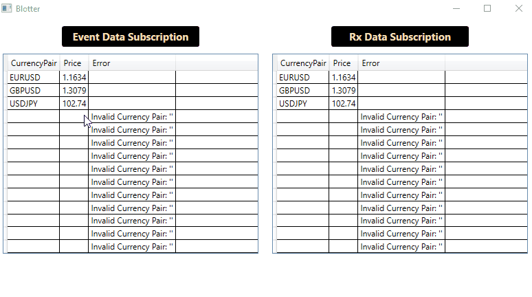

# Blotter-Task

Two Blotter grids subscribes to pricing stream via Event and Observer.

Following issues are addressed
- Prices update
- Prices cannot be overwritten
- Adding the same currency will subscribe to same stream and hence will result in same prices
- Error message is displayed when invalid curreny pair is entered
- Can Subscribe to prices via IObservable

# High level implementation details

- Update Xaml file with two grids. First Grid subscribes to Event, 2nd Grid subscribes to Subscribe
- MainViewModel is used to create two observable collections for two grids
- PriceSourceFactory is used to create a single stream per CcyPair to get prices from single pricing source
- Added a Price Observer which implements the IObsever interface.
- PriceObserverManager is used to Regiser and Dispose the pricing stream Observers

## DEMO

## Authors
- Ravi Bayyana
